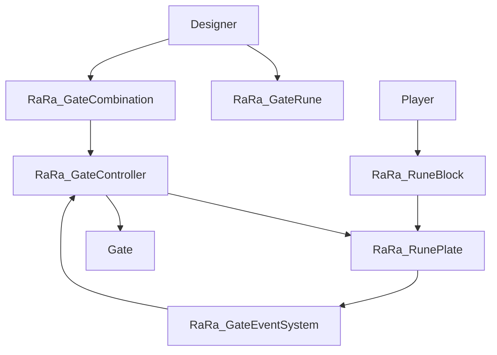

# RaRa Gate Puzzle System Overview

## Script Responsibilities

---

### `RaRa_GateRune` (ScriptableObject)

**Purpose**:  
Holds the static data for a rune type (visuals, glyph, powered state).

- Data only — no logic.
- Used by: `RaRa_RuneBlock`, `RaRa_GateCombination`, designer tools.

---

### `RaRa_GateCombination` (ScriptableObject)

**Purpose**:  
Stores the correct rune sequence. Spawns rune plates and assigns each an expected rune.

- Focused on defining combination logic, not validation.
- Used by: `RaRa_GateController`, `RaRa_RunePlate`.

---

### `RaRa_RuneBlock` (MonoBehaviour)

**Purpose**:  
Represents a physical rune block that can be moved by the player and placed on plates.

- Visual and interactive object.
- Contains a reference to a `RaRa_GateRune`.

---

### `RaRa_RunePlate` (MonoBehaviour)

**Purpose**:  
Validates if the rune placed on it matches its assigned one. Sends result via event.

- Stateless, other than its assigned expected rune.
- Sends result through `RaRa_GateEventSystem`.

---

### `RaRa_GateEventSystem` (Static Class)

**Purpose**:  
Broadcasts events (e.g., rune correct/incorrect) from plates to any interested system.

- Keeps `RaRa_RunePlate` and `RaRa_GateController` decoupled.
- No logic, just events.

---

### `RaRa_GateController` (MonoBehaviour)

**Purpose**:  
Tracks plate correctness. When all are correct, triggers gate unlock/open.

- Acts as the puzzle logic brain.
- Listens to: `RaRa_GateEventSystem`.
- Triggers: Gate animations, sounds, or state transitions.

---

## Signal Chain


---

# Quick Guide: Using ScriptableObjects in Unity

## What is a ScriptableObject?

A `ScriptableObject` is a data container in Unity. It lets you store and reuse data **without attaching it to a GameObject**.

Think of it as a custom `.asset` file to hold configuration or static data.

---

## When to Use It

Use a `ScriptableObject` when you want to:

- Reuse consistent data across multiple objects
- Separate configuration from behavior
- Avoid duplicating data in prefabs
- Let designers tweak values without touching code

---

## How to Create and Use One for the Rune Puzzles

### 1. Create the Script

```csharp
using UnityEngine;

[CreateAssetMenu(menuName = "RaRa/Puzzle/Rune")]
public class RaRa_GateRune : ScriptableObject
{
    public string runeName;
    public Mesh mesh;
    public Material material;
    public Sprite glyph;
    public bool isPowered;
}

```
### 2. Create an Asset in Unity
In the Project window:
`Right-click > Create > RaRa > Puzzle > Rune`

This will generate an asset you can edit in the Inspector.

---

### 3. Use it In another script

```c-sharp
public class RaRa_RuneBlock : MonoBehaviour
{
    public RaRa_GateRune runeData;

    void Start()
    {
        GetComponent<MeshFilter>().mesh = runeData.mesh;
        GetComponent<Renderer>().material = runeData.material;
    }
}
```

The actual block in scene then finds and changes the correct varients in mesh/material or whatever you've set as an option
